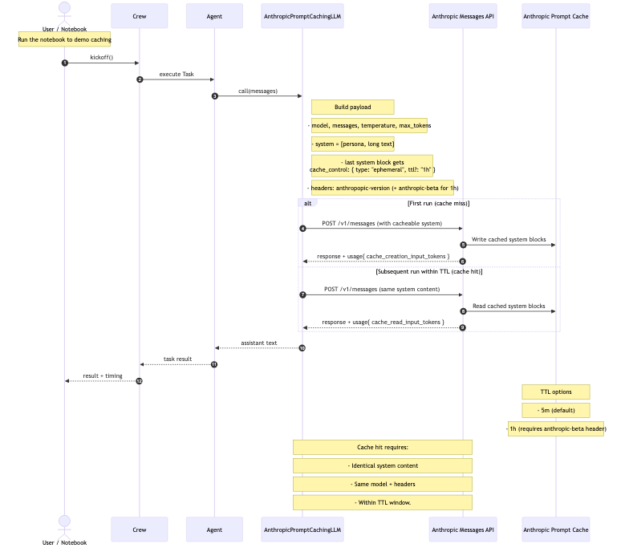

# CrewAI + Anthropic Prompt Caching Cookbook

A comprehensive cookbook demonstrating how to implement CrewAI with Anthropic's prompt caching feature for efficient LLM operations.

## Overview

This notebook demonstrates how to:
- Implement a custom LLM in CrewAI that calls Anthropic's Messages API
- Use Anthropic's prompt caching (5-minute TTL by default; optional 1-hour TTL with beta header)
- Cache a long public-domain text (Frankenstein by Mary Shelley) in the system prompt
- Run tasks multiple times to observe cache performance improvements

## Why this cookbook?

- Prompt caching cuts input cost by up to ~90% and speeds up time-to-first-token by up to ~85% for long prompts by caching the long, repeated part of your prompt (usually system context) across API calls.
- Ideal for multi-turn crews that reuse the same persona/rules, many-shot examples, or large docs across tasks/turns.
- This notebook shows first-run cache write vs. subsequent cache read, how to set TTL (5 m default; optional 1 h beta), and how to verify hits via response usage fields.

## Prompt caching flow



## Features

- **Custom CrewAI LLM**: Extends `crewai.BaseLLM` with Anthropic prompt caching support
- **Configurable Cache TTL**: Support for both 5-minute (default) and 1-hour cache durations
- **Performance Monitoring**: Logs cache read/write token counts for observability
- **Real-world Example**: Uses Mary Shelley's "Frankenstein" to demonstrate caching with substantial content

## Prerequisites

- Python 3.9+
- An Anthropic API key
- Internet access to fetch the public-domain text from Project Gutenberg

## Installation

1. Clone this repository:
```bash
git clone https://github.com/tonykipkemboi/crewai-anthropic-prompt-caching-cookbook.git
cd crewai-anthropic-prompt-caching-cookbook
```

2. Install the required packages:
```bash
pip install -r requirements.txt
```

3. Set your Anthropic API key:
```bash
export ANTHROPIC_API_KEY="your-api-key-here"
```

## Usage

1. Open the Jupyter notebook:
```bash
jupyter notebook crewai_anthropic_prompt_caching_cookbook.ipynb
```

2. Follow the step-by-step instructions in the notebook
3. Run the cells to see prompt caching in action

## Key Components

### AnthropicPromptCachingLLM Class

The custom LLM implementation that:
- Builds Anthropic Messages API payload
- Injects system blocks with cache control
- Handles both 5-minute and 1-hour TTL configurations
- Provides detailed logging of cache performance

### Cache TTL Options

- **5-minute TTL**: Default caching duration, no special header required
- **1-hour TTL**: Extended caching (requires beta access and specific header from Anthropic)

## Performance Benefits

The notebook demonstrates significant performance improvements:
- **First run**: Cache miss, slower response time
- **Second run**: Cache hit, dramatically faster response time
- **Token savings**: Reduced input token costs for cached content

## Troubleshooting

- **Context/window errors**: Reduce `MAX_CHARS_FOR_DEMO` or use shorter text
- **No cache logs**: Ensure you're running within the TTL window without changing system content
- **1-hour TTL issues**: Verify you have the correct `anthropic-beta` header value from Anthropic
- **API errors**: Confirm your Anthropic key has access to the chosen model

## Contributing

Feel free to submit issues, fork the repository, and create pull requests for any improvements.

## License

This project is open source and available under the [MIT License](LICENSE).

## Acknowledgments

- Uses Mary Shelley's "Frankenstein; or, The Modern Prometheus" from Project Gutenberg (public domain)
- Built with CrewAI and Anthropic's Claude models
- Demonstrates Anthropic's prompt caching capabilities
